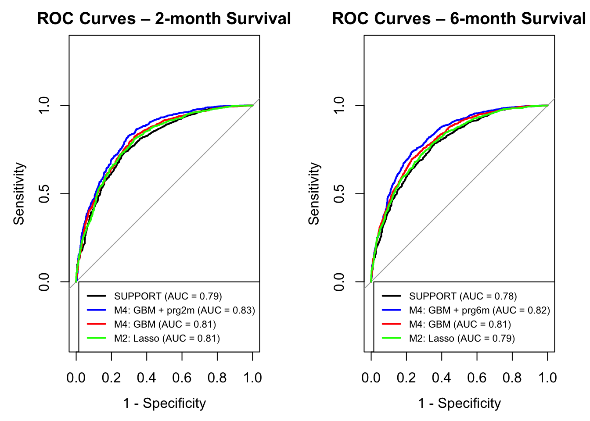

# Forecasting 2- and 6-Month Survival in Critically Ill Patients Using Machine Learning

*Can machine learning improve survival prediction beyond the landmark SUPPORT prognostic model?*

---

## Background

Accurate survival prediction is essential for clinical decision-making in critically ill patients. Prognostic estimates influence treatment planning, goals-of-care discussions, palliative care referrals, and communication with patients and families.

The SUPPORT (Study to Understand Prognoses and Preferences for Outcomes and Risks of Treatment) study developed one of the most widely cited survival prediction models in critical care. However, advances in machine learning offer the potential to capture complex, non-linear relationships that traditional statistical approaches may miss.

This project evaluated whether modern machine learning methods could improve prediction of 2- and 6-month survival using the publicly available SUPPORT2 dataset.

---

## Research Question

> Can machine learning models improve prediction of 2- and 6-month survival in critically ill patients compared with the original SUPPORT prognostic model?

Secondary questions:

* Does model performance differ between short-term (2-month) and longer-term (6-month) prediction horizons?
* Do more complex models outperform simpler approaches such as logistic regression?
* Does clinician judgment contain prognostic information beyond routinely collected clinical variables?

---

## Dataset

* **Source:** SUPPORT2 dataset, UCI Machine Learning Repository
* **Cohort:** 9,105 critically ill adult patients from five U.S. medical centers
* **Primary outcomes:** Survival at 2 months and 6 months after hospital admission
* **Predictors:** Demographics, comorbidities, physiologic measurements, laboratory values, diagnostic categories, and functional status indicators

The dataset was originally developed as part of the SUPPORT study and has become a benchmark dataset for evaluating clinical prognostic models.

---

## Methods

Data preprocessing included missing value handling, feature engineering, categorical variable encoding, and train/test splitting with stratification to preserve outcome distributions.

Four supervised machine learning approaches were developed and compared:

* Logistic Regression
* LASSO Logistic Regression
* Random Forest
* Gradient Boosting Machine (GBM)

Models were trained using repeated 10-fold cross-validation (10 folds × 5 repeats) with AUC-ROC as the primary optimization metric.

Performance was benchmarked against the original SUPPORT prognostic model.

Evaluation metrics included:

* AUC-ROC
* Accuracy
* Sensitivity
* Specificity
* Training time

---

## Results



Gradient Boosting achieved the strongest overall performance across both prediction horizons.

| Model                     | 2-Month AUC | 6-Month AUC |
| ------------------------- | ----------- | ----------- |
| SUPPORT                   | ~0.80       | ~0.78       |
| Logistic Regression       | 0.81        | 0.79        |
| LASSO Logistic Regression | 0.81        | 0.79        |
| Random Forest             | 0.78        | 0.78        |
| Gradient Boosting         | 0.81        | 0.81        |
| GBM + Physician Estimate  | 0.83        | 0.82        |

Performance declined modestly at the 6-month horizon across all models, reflecting increasing uncertainty over longer prediction windows.

---

## Key Findings

* Gradient Boosting achieved the highest discrimination for both prediction horizons (AUC ≈ 0.81).
* Logistic Regression and LASSO performed nearly as well as more complex machine learning approaches.
* Random Forest demonstrated high sensitivity but lower overall discrimination.
* Machine learning models modestly outperformed the original SUPPORT prognostic model.
* Incorporating physician survival estimates improved discrimination further (AUC ≈ 0.83), suggesting clinician judgment contains prognostic information not captured by structured clinical variables alone.

---

## Healthcare Impact

This project highlights several important considerations for clinical decision support design:

**Model complexity:** More complex algorithms provided only modest performance gains over simpler, interpretable approaches.

**Human-AI collaboration:** Physician survival estimates improved prediction beyond structured clinical variables, supporting hybrid approaches that combine clinical expertise with machine learning.

**Clinical deployment:** While Gradient Boosting achieved the highest performance, Logistic Regression delivered comparable discrimination with greater interpretability and lower computational cost.

**Prognostic decision support:** Accurate survival prediction could support treatment planning, palliative care discussions, and shared decision-making for critically ill patients and their families.

---

## Repository Structure

```text
critical-care-survival-ml/
├── README.md
├── notebooks/
│   └── survival_prediction.Rmd
├── figures/
│   └── roc_comparison.png
├── requirements.txt
├── LICENSE
└── .gitignore
```

---

## Reproducibility

The SUPPORT2 dataset is publicly available through the UCI Machine Learning Repository.

Dataset:
https://archive.ics.uci.edu/dataset/880/support2

To reproduce this analysis:

1. Download `support2.csv` from the UCI repository.
2. Place the file in this directory.
3. Run the notebook in `notebooks/`.

All preprocessing, feature engineering, model development, and evaluation steps are documented in the notebook.

---

## Limitations

* Single train/test split without external validation
* Historical dataset collected during the original SUPPORT study period
* Statistical significance testing between model AUCs was not performed
* Performance differences between some models were modest despite observable ranking differences
* Survival prediction was limited to variables available at admission

---

## Future Work

* External validation using contemporary critical care datasets
* Formal statistical comparison of model performance using DeLong's test
* Calibration assessment and decision-curve analysis
* Exploration of explainable AI approaches for clinician-facing deployment
* Prospective evaluation of human-AI hybrid prognostic models incorporating physician estimates
